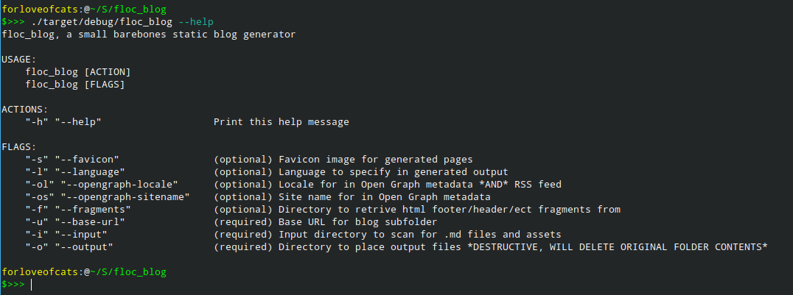

# floc_blog, a small barebones static blog generator

## Is this useful for you? Probably not.

I wanted to set up a blog and all existing blog generators are way to big and
over-engineered for what I wanted to do. I just wanted to be able to write some
markdown, write my own style for it, and publish (including with an RSS feed).

This is not a complete solution. It is just enough for what I want and will
continue to evolve as my needs change. Someday I plan on writing a
web-of-knowledge system which will just happen to support exporting to an HTML
blog as one of its features. That day is not today hence the existence of this
project.

Licensed under GPLv3, no maintainence intended, contributions are discouraged.
If this happens to be useful for you then I am glad, but this project has no
interest in larger appeal.
